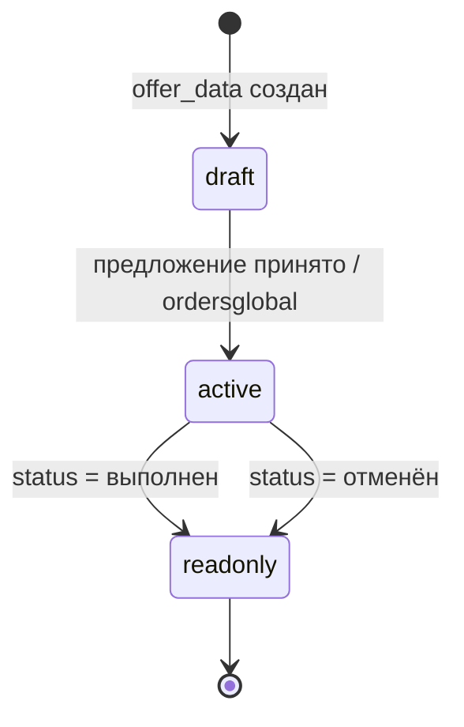
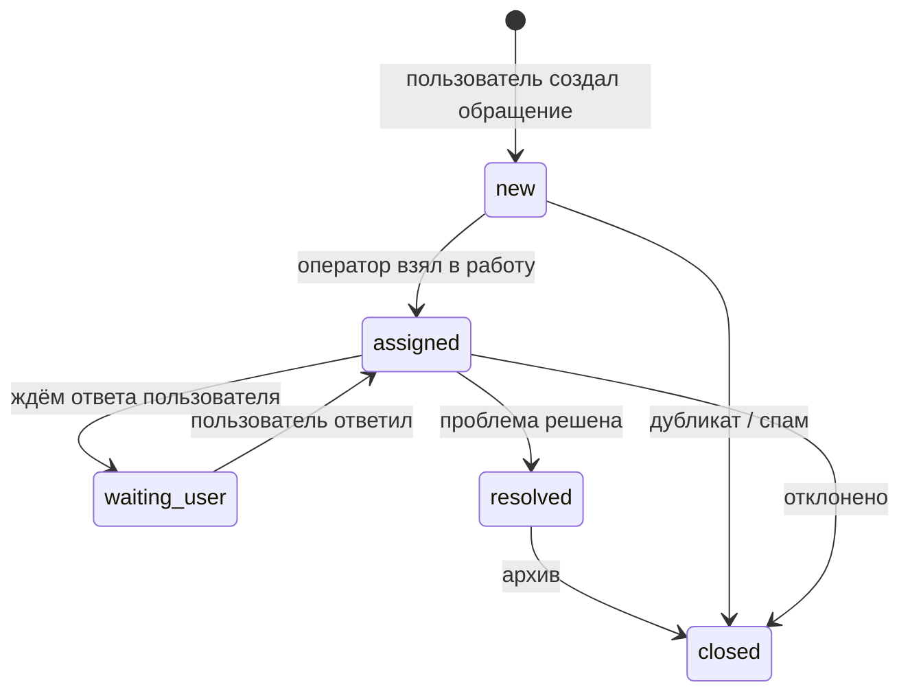

# Логика чатов в приложении CRG Transp 72

**Версия документа:** 1.1  
**Дата:** 4 июля 2026  
**Статус:** реализовано (основной функционал)  
**Свод сценариев:** [app_scenarios_ru.md](./app_scenarios_ru.md) §9  
**Репозиторий:** crgtransp72app-main

---

## 1. Назначение

Документ описывает целевую логику обмена сообщениями в маркетплейсе CRG Transp 72:

- **диалог заказчик ↔ исполнитель** — в контексте отклика, предложения и сделки;
- **чат техподдержки** — между пользователем приложения и оператором в **веб-админке** (`api/admin-web/`).

Документ согласован с текущей архитектурой:

| Компонент | Использование в чатах |
|-----------|------------------------|
| MySQL (`u2395188_apps`) | хранение диалогов и сообщений |
| PHP API (`api/*.php`) | мобильное приложение |
| Flutter | экраны списка чатов и переписки |
| FCM (`users.fcm_token`, `update_fcm_token.php`) | push «есть новое сообщение» |
| `ordersglobal` + `offer_data` | привязка чата по сделке, статус «выполняется» / «выполнен» |
| `admin-web` | очередь и ответы техподдержки |
| `admin_accounts` | авторизация операторов |

> **Важно:** push-рассылка (`broadcast.php`) и чат — разные каналы. Рассылка — односторонняя; чат — двусторонний диалог с историей в БД.

---

## 2. Типы чатов

### 2.1. Сводная таблица

| Тип | Код | Участники | Где открывается | Где ведётся |
|-----|-----|-----------|-----------------|-------------|
| По сделке | `deal` | Заказчик + исполнитель | Приложение | Приложение |
| Техподдержка | `support` | Пользователь + оператор | Приложение | Приложение + **admin-web** |

### 2.2. Диалог по сделке (`deal`)

**Цель:** согласовать детали работ до и во время выполнения заказа без раскрытия лишних контактов до принятия предложения (опционально — политика на этапе v2).

**Привязка к данным:**

```
offer_data (отклик / предложение, bd + id)
        ↓
ordersglobal (сделка: order_id, user_id, user_idok, status)
        ↓
chat_threads (type=deal, bd, ad_id, order_global_id)
```

Пара объявления всегда **`(bd, ad_id)`**, как в поиске и истории (`list_history_zak.php`, `list_history_isp.php`).

### 2.3. Техподдержка (`support`)

**Цель:** вопросы по аккаунту, модерации, оплате подписки, жалобы на объявления.

**Привязка:**

```
support_tickets (обращение пользователя)
        ↓
chat_threads (type=support, support_ticket_id)
        ↓
chat_messages (user ↔ admin)
```

Оператор работает в **admin-web**; пользователь — в приложении.

---

## 3. Жизненный цикл

### 3.1. Чат по сделке



| Статус thread | Кто может писать | Когда |
|---------------|------------------|-------|
| `draft` | оба участника | после первого отклика (`offer_data`) |
| `active` | оба участника | `ordersglobal.status = выполняется` |
| `readonly` | никто | сделка завершена или отменена |
| `closed` | никто | модератор закрыл (жалоба) |

**Системные сообщения** (`sender_type = system`), не от пользователя:

- «Исполнитель отправил предложение»
- «Заказ принят к выполнению»
- «Заказ отмечен как выполненный»
- «Сделка отменена»

Источник статуса: `ordersglobal.status`, `offer_data.status`.

### 3.2. Тикет техподдержки



| Статус ticket | Смысл для оператора |
|---------------|---------------------|
| `new` | в очереди, не назначен |
| `assigned` | в работе у оператора |
| `waiting_user` | отправлен ответ, ждём пользователя |
| `resolved` | решено, можно запросить оценку |
| `closed` | архив (дубликат, спам, окончательно) |

---

## 4. Модель данных (MySQL)

### 4.1. Таблица `chat_threads`

Единый контейнер диалога.

| Поле | Тип | Описание |
|------|-----|----------|
| `id` | INT PK AI | |
| `type` | ENUM(`deal`,`support`) | тип чата |
| `status` | ENUM(`draft`,`active`,`readonly`,`closed`) | см. §3 |
| `user_id_customer` | INT NULL | заказчик (`users.idusers`) |
| `user_id_performer` | INT NULL | исполнитель; NULL для support |
| `bd` | TINYINT NULL | 1 / 2 / 3 для `deal` |
| `ad_id` | INT NULL | id объявления в таблице раздела |
| `offer_data_id` | INT NULL | связь с откликом |
| `order_global_id` | INT NULL | `ordersglobal.id` или аналог PK |
| `support_ticket_id` | INT NULL | FK → `support_tickets.id` |
| `last_message_at` | DATETIME NULL | для сортировки списка |
| `last_message_preview` | VARCHAR(255) NULL | превью (без PII) |
| `created_at` | DATETIME | |
| `updated_at` | DATETIME | |

**Индексы (рекомендуемые):**

- `(user_id_customer, last_message_at DESC)`
- `(user_id_performer, last_message_at DESC)`
- `(type, status, last_message_at DESC)`
- UNIQUE `(type, bd, ad_id, user_id_customer, user_id_performer)` для `deal` — один thread на пару по объявлению

### 4.2. Таблица `support_tickets`

| Поле | Тип | Описание |
|------|-----|----------|
| `id` | INT PK AI | |
| `user_id` | INT NOT NULL | автор обращения |
| `subject` | VARCHAR(255) | тема |
| `category` | ENUM | см. §4.2.1 |
| `status` | ENUM | см. §3.2 |
| `priority` | ENUM(`normal`,`high`) | по умолчанию `normal` |
| `assigned_admin_id` | INT NULL | FK → `admin_accounts.id` |
| `context_json` | JSON NULL | контекст из приложения |
| `rating` | TINYINT NULL | 1–5 после закрытия |
| `rating_comment` | TEXT NULL | |
| `created_at` | DATETIME | |
| `assigned_at` | DATETIME NULL | |
| `closed_at` | DATETIME NULL | |

#### 4.2.1. Категории обращений (`category`)

| Значение | Подпись в UI |
|----------|--------------|
| `account` | Аккаунт и вход |
| `ad_moderation` | Модерация объявления |
| `payment` | Подписка и оплата |
| `deal_dispute` | Спор по заказу |
| `bug` | Ошибка приложения |
| `other` | Другое |

#### 4.2.2. Поле `context_json` (пример)

```json
{
  "app_version": "6.0.0+26",
  "platform": "android",
  "bd": 2,
  "ad_id": 15,
  "order_global_id": 7,
  "screen": "OrderExecutionScreen"
}
```

### 4.3. Таблица `chat_messages`

| Поле | Тип | Описание |
|------|-----|----------|
| `id` | BIGINT PK AI | |
| `thread_id` | INT NOT NULL | FK → `chat_threads.id` |
| `sender_type` | ENUM(`user`,`admin`,`system`) | |
| `sender_user_id` | INT NULL | если `user` |
| `sender_admin_id` | INT NULL | если `admin` |
| `body` | TEXT NOT NULL | текст (MVP) |
| `attachment_path` | VARCHAR(512) NULL | v2: файл на сервере |
| `attachment_mime` | VARCHAR(64) NULL | |
| `read_at` | DATETIME NULL | прочитано получателем |
| `is_deleted` | TINYINT(1) DEFAULT 0 | мягкое удаление (модерация) |
| `created_at` | DATETIME | |

**Индекс:** `(thread_id, id)` — пагинация истории.

### 4.4. Таблица `chat_read_state` (опционально)

Для счётчика непрочитанных без пересчёта всех сообщений.

| Поле | Тип | Описание |
|------|-----|----------|
| `thread_id` | INT | |
| `user_id` | INT NULL | участник-пользователь |
| `admin_id` | INT NULL | оператор |
| `last_read_message_id` | BIGINT | |

### 4.5. Таблица `chat_admin_actions` (аудит)

| Поле | Тип | Описание |
|------|-----|----------|
| `id` | INT PK AI | |
| `admin_id` | INT | |
| `ticket_id` | INT NULL | |
| `thread_id` | INT NULL | |
| `action` | VARCHAR(64) | `assign`, `close`, `delete_message`, … |
| `meta_json` | JSON NULL | |
| `created_at` | DATETIME | |

---

## 5. Правила доступа

### 5.1. Пользователь (приложение)

| Действие | Условие |
|----------|---------|
| Видеть thread `deal` | `idusers` = customer или performer в thread |
| Писать в `deal` | thread.status ∈ (`draft`, `active`) |
| Создать ticket support | авторизован (`token` → `resolveUserIdFromToken`) |
| Писать в support | thread привязан к ticket пользователя, ticket не `closed` |
| Читать историю | участник thread |

Заблокированный пользователь (`users.flag = 0`): только чтение или запрет входа в чат — **решение на этапе MVP: readonly**.

### 5.2. Оператор (admin-web)

| Действие | Роль |
|----------|------|
| Видеть очередь `new` | operator, admin |
| Взять ticket (`assign`) | operator, admin |
| Отвечать в support | назначенный оператор или admin |
| Закрыть ticket | operator, admin |
| Удалить сообщение | admin |
| Просмотр `deal` при жалобе | admin (v2) |

Роли расширяют `admin_accounts` (поле `role` или отдельная таблица `admin_roles`).

---

## 6. API для мобильного приложения

Базовый путь: `/api/chat/`. Авторизация: `token` (как в `getuserinfo.php`).

### 6.1. Список диалогов

**`GET /api/chat/threads.php`**

| Параметр | Описание |
|----------|----------|
| `token` | обязательно |
| `type` | опционально: `deal` \| `support` \| все |
| `page`, `limit` | пагинация |

**Ответ (элемент массива):**

```json
{
  "id": 12,
  "type": "deal",
  "status": "active",
  "title": "Экскаватор · Тюмень",
  "counterpart_name": "Иванов А.",
  "unread_count": 2,
  "last_message_preview": "Выезжаю через час",
  "last_message_at": "2026-07-03 10:15:00",
  "bd": 2,
  "ad_id": 6,
  "order_global_id": 41
}
```

### 6.2. История сообщений

**`GET /api/chat/messages.php`**

| Параметр | Описание |
|----------|----------|
| `token` | |
| `thread_id` | |
| `before_id` | курсор для подгрузки старых |
| `limit` | по умолчанию 50 |

### 6.3. Отправка сообщения

**`POST /api/chat/send.php`**

| Поле | Описание |
|------|----------|
| `token` | |
| `thread_id` | |
| `body` | текст, max 4000 символов |

Проверки: XSS-экранирование при выводе, rate limit (§9), статус thread.

### 6.4. Прочитано

**`POST /api/chat/read.php`**

| Поле | Описание |
|------|----------|
| `token` | |
| `thread_id` | |
| `last_read_message_id` | |

### 6.5. Создание обращения в поддержку

**`POST /api/support/create.php`**

| Поле | Описание |
|------|----------|
| `token` | |
| `subject` | |
| `category` | см. §4.2.1 |
| `body` | первое сообщение |
| `context_json` | опционально |

Создаёт `support_tickets` + `chat_threads` + первое `chat_messages`.

### 6.6. Polling (MVP)

**`GET /api/chat/poll.php`**

| Параметр | Описание |
|----------|----------|
| `token` | |
| `thread_id` | |
| `after_id` | последний известный id сообщения |

Интервал на клиенте: **5–10 с** при открытом чате; при свёрнутом приложении — только FCM.

---

## 7. Push-уведомления (FCM)

Переиспользовать инфраструктуру из `api/include/admin_mail.php` / Firebase OAuth.

| Событие | Получатель | Текст push (пример) |
|---------|------------|---------------------|
| Новое сообщение в `deal` | вторая сторона | «Новое сообщение по заказу» |
| Ответ поддержки | пользователь | «Ответ службы поддержки» |
| Новый ticket | операторы (опционально) | только admin-web badge, без push |

**Не включать** текст сообщения в push (конфиденциальность).

Payload data:

```json
{
  "type": "chat_message",
  "thread_id": "12",
  "chat_type": "deal"
}
```

Приложение по tap открывает нужный thread.

---

## 8. Веб-админка: раздел «Поддержка»

Новые страницы в `api/admin-web/` (имена — ориентир):

| Файл | Назначение |
|------|------------|
| `support_queue.php` | очередь: `status = new` |
| `support_list.php` | все открытые + фильтры |
| `support_view.php` | карточка тикета + переписка + ответ |
| `support_assign.php` | POST: взять в работу |
| `support_close.php` | POST: закрыть с причиной |
| `support_stats.php` | SLA и аналитика (можно в `stats.php`) |

Логика в `api/include/admin_support.php` (по аналогии с `admin_users.php`, `admin_stats.php`).

Пункт меню в `bootstrap_web.php`:

```text
Поддержка → support_queue.php
```

Badge: число ticket со `status = new` (как красная точка у объявлений на проверке).

### 8.1. Экран «Очередь» (`support_queue.php`)

**Колонки таблицы:**

| Колонка | Источник |
|---------|----------|
| № ticket | `support_tickets.id` |
| Дата | `created_at` |
| Пользователь | `users` (имя, idusers, город) |
| Категория | `category` |
| Тема | `subject` |
| Приоритет | `priority` |
| Действие | кнопка «Взять» |

**Фильтры:** категория, дата, город пользователя, приоритет.

### 8.2. Экран «Диалог» (`support_view.php`)

**Левая / верхняя панель — карточка пользователя:**

- ФИО, телефон, e-mail, `idusers`
- роль (`rollNum`), статус модерации (`flag`)
- подписка исполнителя (`subscriptions`) — если применимо
- ссылки: `user_edit.php`, объявления пользователя

**Центр — лента сообщений:**

- сообщения пользователя слева, оператора справа
- системные — по центру, серым
- время, статус прочтения

**Низ — форма ответа:**

- textarea + «Отправить»
- выпадающий список **шаблонов** (§8.4)
- кнопки статуса: «Ждём пользователя», «Решено», «Закрыть»

**Правая панель — контекст:**

- JSON из `context_json`
- ссылки на объявление: `customer_ad_view.php` / `performer_ad_view.php`
- сделка: `ordersglobal` (если есть в контексте)

### 8.3. Функции администрирования чатов

#### Очередь и назначение

- [ ] список новых обращений без оператора
- [ ] «Взять в работу» — `assigned_admin_id`, `status = assigned`
- [ ] «Передать коллеге» — смена `assigned_admin_id`
- [ ] фильтр «Мои диалоги» / «Все открытые» / «Архив»
- [ ] счётчик непрочитанных на пункте меню

#### Работа с диалогом

- [ ] отправка ответа от имени поддержки (`sender_type = admin`)
- [ ] смена статуса ticket (§3.2)
- [ ] просмотр профиля и объявлений пользователя без выхода из чата
- [ ] прикрепление внутренней заметки (v2, только для админов, не видна пользователю)

#### Модерация

- [ ] мягкое удаление сообщения (`is_deleted = 1`)
- [ ] блокировка отправки пользователю в рамках ticket
- [ ] закрытие как «дубликат» / «спам»
- [ ] просмотр чатов `deal` при жалобе `deal_dispute` (v2)

#### Шаблоны ответов (§8.4)

- [ ] справочник быстрых фраз
- [ ] редактирование шаблонов в «Настройки» (v2)

#### Аналитика (блок на `stats.php` или отдельная страница)

- [ ] обращений за день / неделю / месяц
- [ ] среднее время первого ответа (SLA)
- [ ] среднее время до `resolved`
- [ ] распределение по `category`
- [ ] средняя оценка `rating` по оператору
- [ ] нагрузка: ticket на оператора

#### Безопасность и аудит

- [ ] лог действий в `chat_admin_actions`
- [ ] rate limit на отправку (§9)
- [ ] автоответ вне рабочих часов (настройка в `settings.php`)
- [ ] роли: operator / admin

### 8.4. Шаблоны быстрых ответов (MVP)

| ID | Текст |
|----|-------|
| `t1` | Здравствуйте! Мы получили ваше обращение и уже проверяем информацию. |
| `t2` | Пожалуйста, пришлите скриншот ошибки и номер объявления. |
| `t3` | Ваше объявление находится на модерации, обычно это занимает до 24 часов. |
| `t4` | Обращение закрыто. Если вопрос остался — создайте новое обращение. |

---

## 9. Ограничения и антиспам

| Правило | Значение MVP |
|---------|--------------|
| Макс. длина сообщения | 4000 символов |
| Сообщений в минуту на user | 20 |
| Активных ticket support на user | 1 (или 3 с предупреждением) |
| Мин. интервал создания ticket | 60 с |
| Вложения | отключены в MVP |

---

## 10. UX мобильного приложения

### 10.1. Точки входа

| Место | Действие | Тип чата |
|-------|----------|----------|
| Профиль заказчика / исполнителя | «Поддержка» | support |
| `OfferScreen` / отклики | «Написать» | deal |
| `OrderExecutionScreen` / `OrderExecutionScreenzak` | «Чат по заказу» | deal |
| Карточка в `list_predloj_*` | «Сообщение» | deal |
| Жалоба на объявление (v2) | «Сообщить» → ticket с контекстом | support |

### 10.2. Экран «Сообщения» (новый)

**Структура:**

```
Сообщения
├── По заказам        (threads type=deal)
└── Поддержка         (threads type=support)
```

Элемент списка: аватар, имя, превью, время, badge непрочитанных.

**Файлы (ориентир при реализации):**

- `lib/pages/chat_list_screen.dart`
- `lib/pages/chat_thread_screen.dart`
- `lib/services/chat_api.dart`
- `lib/models/chat_thread.dart`, `chat_message.dart`

### 10.3. Экран переписки

- лента с пагинацией вверх
- поле ввода + отправка
- pull-to-refresh / polling
- AppBar: контекст сделки (город, услуга) или тема support

### 10.4. Оценка поддержки

После перевода ticket в `resolved`:

1. push или баннер в приложении
2. экран «Оцените ответ» (1–5 звёзд + необязательный комментарий)
3. запись в `support_tickets.rating`, `rating_comment`

---

## 11. Связь с существующими сущностями

| Сущность | Связь с чатами |
|----------|----------------|
| `offer_data` | создание / открытие `deal` thread при отклике |
| `ordersglobal` | активация thread, системные сообщения по смене status |
| `users` | участники, FCM |
| `reviews` / `reviewsisp` | не смешивать с оценкой support |
| `admin-web/users.php` | переход из ticket на карточку пользователя |
| `broadcast.php` | не использовать для ответов в диалоге |

### 11.1. Когда создавать `deal` thread автоматически

| Событие | API / место | Действие |
|---------|-------------|----------|
| Исполнитель отправил отклик | `offer_data` insert | создать thread `draft` |
| Заказчик принял предложение | `ordersglobal` insert | `status → active`, system msg |
| Сделка завершена | update `ordersglobal` | `readonly`, system msg |

---

## 12. Этапы внедрения — статус (2 августа 2026)

| Фаза | Содержание | Статус |
|------|------------|--------|
| **1. Support MVP** | таблицы, API support + messages, admin `support_*`, FCM, текст | ✓ |
| **2. Deal chat** | thread по offer/ordersglobal, UI в приложении | ✓ |
| **3. Улучшения** | фото/документы, polling admin, оценка support | ✓ (MVP) |
| **4. Модерация P2P** | просмотр deal admin, жалобы, WebSocket | жалобы + readonly deal-чат в админке ✓; WebSocket — нет |

Свод сценариев и точек входа: **[app_scenarios_ru.md](./app_scenarios_ru.md) §9**.  
Деплой P1: **[deploy_p1_checklist.md](./deploy_p1_checklist.md)**.

### 12.1. Чеклист фазы 1–3 (Support + Deal)

**БД**

- [x] миграция: `support_tickets`, `chat_threads`, `chat_messages` (`sql/migrate_chat_support.sql`)
- [x] индексы §4.1, §4.3

**API**

- [x] `support/create.php`, `chat/threads.php`, `chat/messages.php`, `chat/send.php`, `chat/read.php`, `chat/poll.php`
- [x] `support_poll.php` (admin-web)

**admin-web**

- [x] `support_queue.php`, `support_view.php`, `support_assign.php`, `support_close.php`
- [x] пункт меню + badge
- [x] `admin_support.php`, `support_attachment.php`

**Flutter**

- [x] «Поддержка» и списки чатов в профиле (отдельно для заказчика / исполнителя)
- [x] экран переписки без нижнего меню
- [x] FCM `chat_message` → открытие thread
- [x] вложения (изображения, документы)
- [x] `SupportRatingSheet` после `resolved`

### 12.2. Чеклист фазы 4 (жалобы + deal admin) — P1

**Flutter**

- [x] `ChatApi.createSupportTicket` + `context_json`
- [x] «Пожаловаться» в deal-чате → `deal_dispute` + thread/ad/order ids
- [x] «Пожаловаться» с карточки объявления/заявки → `ad_moderation`

**admin-web**

- [x] фильтр очереди «Жалобы» / `deal_dispute` / `ad_moderation`
- [x] человекочитаемый `context_json` на `support_view.php`
- [x] `deal_chat_view.php` — readonly сообщения deal-thread
- [ ] WebSocket / realtime (вне P1)

---

## 13. SQL-миграция (черновик)

Файл для реализации: `sql/migrate_chat_support.sql`

```sql
CREATE TABLE support_tickets (
  id INT AUTO_INCREMENT PRIMARY KEY,
  user_id INT NOT NULL,
  subject VARCHAR(255) NOT NULL,
  category ENUM('account','ad_moderation','payment','deal_dispute','bug','other') NOT NULL DEFAULT 'other',
  status ENUM('new','assigned','waiting_user','resolved','closed') NOT NULL DEFAULT 'new',
  priority ENUM('normal','high') NOT NULL DEFAULT 'normal',
  assigned_admin_id INT NULL,
  context_json JSON NULL,
  rating TINYINT NULL,
  rating_comment TEXT NULL,
  created_at DATETIME NOT NULL DEFAULT CURRENT_TIMESTAMP,
  assigned_at DATETIME NULL,
  closed_at DATETIME NULL,
  INDEX idx_support_status_created (status, created_at),
  INDEX idx_support_user (user_id)
) ENGINE=InnoDB DEFAULT CHARSET=utf8mb4;

CREATE TABLE chat_threads (
  id INT AUTO_INCREMENT PRIMARY KEY,
  type ENUM('deal','support') NOT NULL,
  status ENUM('draft','active','readonly','closed') NOT NULL DEFAULT 'draft',
  user_id_customer INT NULL,
  user_id_performer INT NULL,
  bd TINYINT NULL,
  ad_id INT NULL,
  offer_data_id INT NULL,
  order_global_id INT NULL,
  support_ticket_id INT NULL,
  last_message_at DATETIME NULL,
  last_message_preview VARCHAR(255) NULL,
  created_at DATETIME NOT NULL DEFAULT CURRENT_TIMESTAMP,
  updated_at DATETIME NOT NULL DEFAULT CURRENT_TIMESTAMP ON UPDATE CURRENT_TIMESTAMP,
  INDEX idx_threads_customer (user_id_customer, last_message_at),
  INDEX idx_threads_performer (user_id_performer, last_message_at),
  INDEX idx_threads_support (support_ticket_id)
) ENGINE=InnoDB DEFAULT CHARSET=utf8mb4;

CREATE TABLE chat_messages (
  id BIGINT AUTO_INCREMENT PRIMARY KEY,
  thread_id INT NOT NULL,
  sender_type ENUM('user','admin','system') NOT NULL,
  sender_user_id INT NULL,
  sender_admin_id INT NULL,
  body TEXT NOT NULL,
  attachment_path VARCHAR(512) NULL,
  read_at DATETIME NULL,
  is_deleted TINYINT(1) NOT NULL DEFAULT 0,
  created_at DATETIME NOT NULL DEFAULT CURRENT_TIMESTAMP,
  INDEX idx_messages_thread (thread_id, id)
) ENGINE=InnoDB DEFAULT CHARSET=utf8mb4;
```

---

## 14. Отличие от других каналов

| Канал | Направление | История в admin-web |
|-------|-------------|---------------------|
| Телефон (`tel:` в карточках) | вне приложения | нет |
| E-mail (`admin_mail.php`) | исходящие уведомления | нет |
| FCM broadcast | односторонний push | нет |
| **Чат support** | двусторонний | **да** |
| **Чат deal** | двусторонний | только при модерации (v2) |

---

## 15. Связанные документы

| Документ | Содержание |
|----------|------------|
| **[app_scenarios_ru.md](./app_scenarios_ru.md)** | **Свод всех сценариев и промптов (§9 — чаты)** |
| [admin_guide.md](./admin_guide.md) | текущие разделы admin-web |
| [search_logic_ru.md](./search_logic_ru.md) | пара `(bd, ad_id)` |
| [REG_DATA_FORMS_RU.md](../REG_DATA_FORMS_RU.md) | авторизация пользователя |
| [BRANCH_SCREENS_MAP_RU.md](../BRANCH_SCREENS_MAP_RU.md) | карта экранов приложения |

---

*Документ подготовлен на основе архитектуры CRG Transp 72: PHP API, Flutter, MySQL, FCM, admin-web, `ordersglobal`, `offer_data`.*
